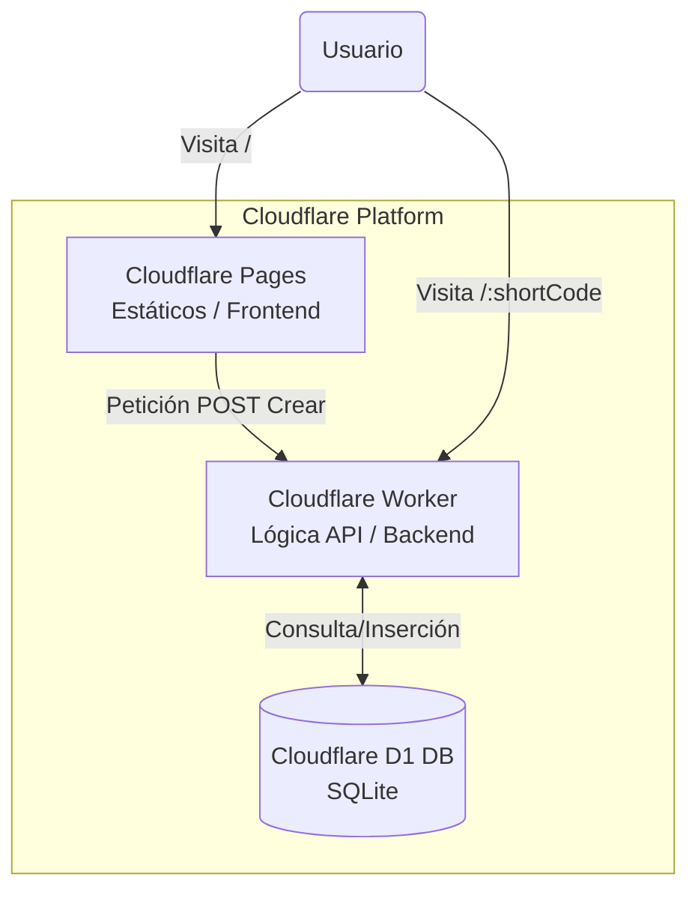
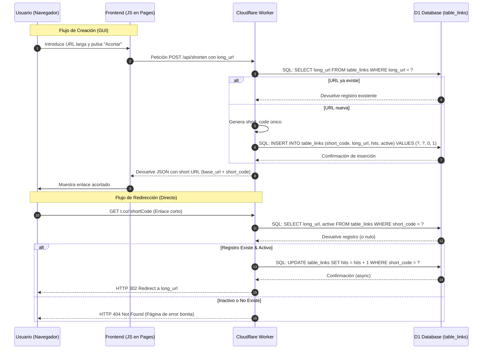

# 🔗 Acortador de Enlaces Serverless (Cloudflare D1)

[](https://acortador-enlaces.pages.dev)
[](https://developer.mozilla.org/en-US/docs/Web/HTML)
[](https://developer.mozilla.org/en-US/docs/Web/CSS)
[](https://developer.mozilla.org/en-US/docs/Web/JavaScript)
[](https://workers.cloudflare.com/)
[](https://developers.cloudflare.com/d1/)

Un acortador de URLs moderno, rápido y extremadamente ligero, construido enteramente sobre la infraestructura **Serverless de Cloudflare**. Este proyecto demuestra el poder de la integración de frontend estático (Pages), lógica de backend (Workers) y base de datos SQL (D1).

---

## 📝 Descripción

Este proyecto permite a los usuarios transformar URLs largas y complejas en enlaces cortos y fáciles de compartir.

La aplicación utiliza **Cloudflare Pages** para servir una interfaz de usuario limpia y oscura (con estilos CSS modernos y gradientes visuales). Cuando un usuario interactúa con la interfaz, el frontend se comunica con un **Cloudflare Worker**. Este Worker maneja la lógica de negocio (generación de códigos únicos, validación) e interactúa con **Cloudflare D1**, una base de datos SQLite nativa de Cloudflare, para almacenar y recuperar los enlaces.

## ✨ Funcionalidades

* 🚀 **Acortamiento Instantáneo:** Generación rápida de códigos cortos únicos para cualquier URL válida.
* 🚦 **Redirección de Alta Velocidad:** Las redirecciones son manejadas en el "Edge" por el Worker, minimizando la latencia.
* 📊 **Contador de Visitas (Hits):** Cada redirección exitosa incrementa un contador en la base de datos (basado en el esquema proporcionado).
* 🛡️ **Validación de URLs:** El frontend y backend validan que la entrada sea una URL correcta antes de procesarla.
* 🌓 **Interfaz Moderna:** Diseño oscuro optimizado para la experiencia del usuario.

## 🛠️ Stack Tecnológico

* **Frontend (Cloudflare Pages):** HTML5, CSS3 (con diseño oscuro moderno), JavaScript Vanilla.
* **Backend & API (Cloudflare Workers):** Lógica de servidor y enrutamiento en el Edge.
* **Base de Datos (Cloudflare D1):** Almacenamiento SQL (SQLite) para los enlaces.

---

## ⚙️ Arquitectura y Flujo Técnico

El proyecto sigue una arquitectura Serverless moderna dividida en tres capas principales que interactúan entre sí.

### 📊 Diagrama de Arquitectura

<div style="text-align:center">



</div>

## 👉 Flujo de Lógica: Creación y Redirección
El siguiente diagrama detalla cómo se gestiona la base de datos basándose en el esquema proporcionado (`short_code`, `long_url`, `hits`, `active`):

<div style="text-align:center">



</div>

## 📂 Estructura del Proyecto
La estructura es sencilla y sigue el estándar para proyectos que combinan Pages y Workers.

```
.
├── src_frontend/       # Archivos estáticos para Cloudflare Pages
│   ├── index.html      # Interfaz de usuario
│   ├── styles.css      # Estilos modernos (dark mode)
│   └── script.js       # Lógica del cliente (fetch al Worker)
├── schema.sql          # Script SQL para inicializar la base de datos D1
├── worker.js           # Lógica del Cloudflare Worker (backend API)
├── wrangler.jsonc      # Configuración de Wrangler (Bindings para D1 y Pages)
└── README.md           # Documentación
```

## 🗄️ Esquema de la Base de Datos D1
Basado en el archivo `tabla_links.csv` proporcionado, la estructura de la tabla `table_links` es la siguiente:

```sql
CREATE TABLE table_links (
    id INTEGER PRIMARY KEY AUTOINCREMENT, -- Recomendado para indexación interna
    short_code TEXT NOT NULL UNIQUE,     -- El código corto (ej: 'aBcDe')
    long_url TEXT NOT NULL,              -- La URL de destino original
    hits INTEGER DEFAULT 0,              -- Contador de visitas
    active INTEGER DEFAULT 1,             -- Estado (1: Activo, 0: Inactivo)
    created_at DATETIME DEFAULT CURRENT_TIMESTAMP -- Recomendado para control de tiempo
);

-- Índice para acelerar las redirecciones
CREATE INDEX idx_short_code ON table_links(short_code);
```

## 🚀 Instalación y Despliegue
Sigue estos pasos para desplegar tu propio acortador en Cloudflare.

### Prerrequisitos
Cuenta de Cloudflare.

Node.js y npm instalados.

Wrangler CLI instalado (npm install -g wrangler).

### Pasos
**1. Clonar el repositorio:**
```bash
git clone [https://github.com/tu-usuario/link-shortener-d1.git](https://github.com/tu-usuario/link-shortener-d1.git)
cd link-shortener-d1
```

**2. Iniciar sesión en Cloudflare:**
```bash
wrangler login
```

**3. Crear la Base de Datos D1:**
```
wrangler d1 create link-shortener-db
```
Copia el `database_id` que te devuelve la consola y actualízalo en tu archivo `wrangler.jsonc`.

4. Inicializar el Esquema de D1:
```bash
# Reemplaza 'link-shortener-db' con el nombre que elegiste
wrangler d1 execute link-shortener-db --file=./schema.sql
```

5. Desplegar el Worker (Backend):
```bash
wrangler deploy
```

**6. Desplegar el Frontend (Pages):**
Puedes hacerlo desde el panel de control de Cloudflare conectando este repositorio a Pages, o usando Wrangler:
```bash
wrangler pages deploy src_frontend --project-name=tu-proyecto-pages
```

## 👤 Autor
Jon Aldeko - GitHub Profile

Desarrollado como una demostración técnica de la integración de Cloudflare Pages, Workers y D1.