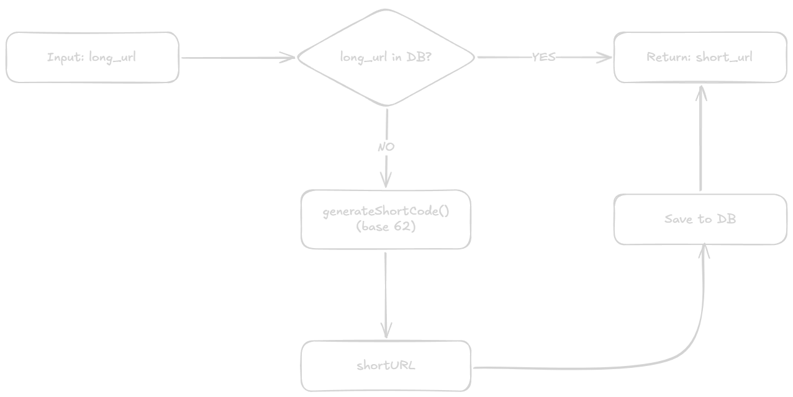
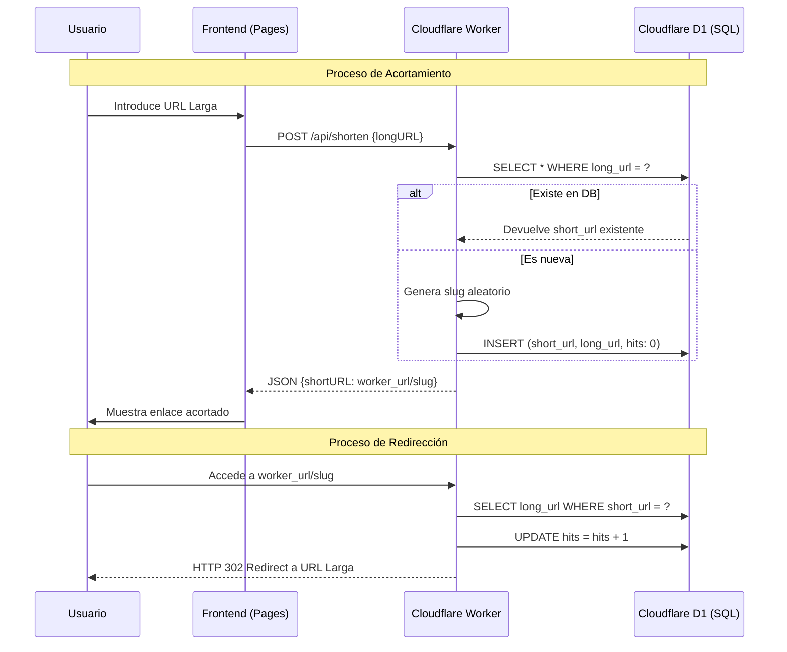

<div align="center">

# 🔗 Acortador de Enlaces Serverless

[](https://acortador-enlaces.pages.dev)

</div>

[](https://developer.mozilla.org/en-US/docs/Web/HTML)
[](https://developer.mozilla.org/en-US/docs/Web/CSS)
[](https://developer.mozilla.org/en-US/docs/Web/JavaScript)
[](https://workers.cloudflare.com/)
[](https://developers.cloudflare.com/d1/)

Una solución moderna y extremadamente rápida para la gestión de URLs cortas, construida íntegramente sobre la infraestructura global de **Cloudflare**. Combina la potencia del Edge Computing con la persistencia de una base de datos SQL serverless.


---

## 📝 Descripción

El **Acortador de Enlaces** permite transformar URLs largas y pesadas en enlaces cortos y memorables. A diferencia de otras soluciones, este proyecto no solo realiza la redirección, sino que gestiona un estado persistente en **Cloudflare D1**, permitiendo llevar un control de la actividad (hits) y el estado de cada enlace en tiempo real.

---

## ✨ Funcionalidades

* **Generación de Slugs Alfanuméricos:** Crea códigos únicos de 6 caracteres para cada URL.
* **Redirección en el Edge:** Las redirecciones se procesan en el punto de presencia de Cloudflare más cercano al usuario, garantizando latencia mínima.
* **Analítica Básica (Hits):** Incrementa automáticamente un contador en la base de datos SQL con cada visita.
* **Persistencia Inteligente:** Si una URL ya ha sido acortada previamente, el sistema recupera el enlace existente en lugar de duplicarlo.
* **Interfaz Moderna:** Diseño oscuro (Dark Mode) optimizado para una experiencia de usuario limpia y funcional.

## 🛠️ Stack Tecnológico

* **Frontend:** HTML5, CSS3, JavaScript Vanilla (ES6+), servido en **Cloudflare Pages**.
* **Backend (API):** **Cloudflare Workers** gestionando peticiones POST y GET.
* **Base de Datos:** **Cloudflare D1** (SQLite nativo en el Edge).
* **Configuración:** Wrangler (Cloudflare CLI).

---

## ⚙️ Enfoque Técnico

El proyecto separa la capa de presentación (Pages) de la capa lógica y de datos (Worker + D1). Esto permite que el frontend sea extremadamente ligero mientras que el Worker actúa como un orquestador entre el cliente y la base de datos SQL.

### Flujo de Decisión del Backend
Para optimizar el almacenamiento y evitar registros redundantes, el Worker sigue una lógica de verificación previa antes de generar cualquier código nuevo:



> [!TIP]
> **Eficiencia en D1:** Gracias a este flujo, si 100 usuarios intentan acortar la misma URL (ej: `google.com`), la base de datos solo almacenará un registro, devolviendo a todos el mismo `short_url`.

### Diagrama de Flujo (Creación y Uso)



## 🗄️ Esquema de Base de Datos
El sistema utiliza una tabla optimizada en Cloudflare D1 con la siguiente estructura:

```sql
CREATE TABLE table_links (
  id INTEGER PRIMARY KEY AUTOINCREMENT,
  short_url TEXT NOT NULL UNIQUE,   -- El slug generado (ej: 'aBcDe1')
  long_url TEXT NOT NULL,           -- URL de destino
  hits INTEGER DEFAULT 0,           -- Contador de visitas
  active INTEGER DEFAULT 1          -- Estado del enlace
);
```

## 📂 Estructura del Proyecto

```
.
├── index.html          # Interfaz de usuario
├── style.css           # Estilos (Dark Mode)
├── script.js           # Consumo de la API y manejo del DOM
├── worker.js           # Lógica del backend y consultas SQL
├── schema.sql          # Definición de tablas para D1
├── wrangler.jsonc      # Configuración de bindings y entorno
└── README.md           # Documentación
```

## 🚀 Instalación y Despliegue

1. Clonar y forkear el repositorio:

 ```bash
 git clone https://github.com/Jaldekoa/acortador-enlaces.git
 ```

 2. Crear y configurar un worker en [Cloudflare Workers](https://workers.cloudflare.com/):

    - Copiándo y pegando el código del archivo `worker.js` en un nuevo Worker de Cloudflare ó

3. Crear y configurar una base de datos SQL en [Cloudflare D1](https://developers.cloudflare.com/d1/):

    - Crea una nueva tabla usando el archivo `schema.sql`.

4. Modifique los datos del archivo `wrangler.json` por los de su Worker y D1, deje vacío el comando de compilación, deje como `/` el directorio raíz de su repositorio del fork y use `exit 0` como comando de implementación.

> [!IMPORTANT]
> Recuerde añadir el enlace entre el worker y la BBDD D1.

---

## 👤 Autor
[](https://github.com/Jaldekoa)
